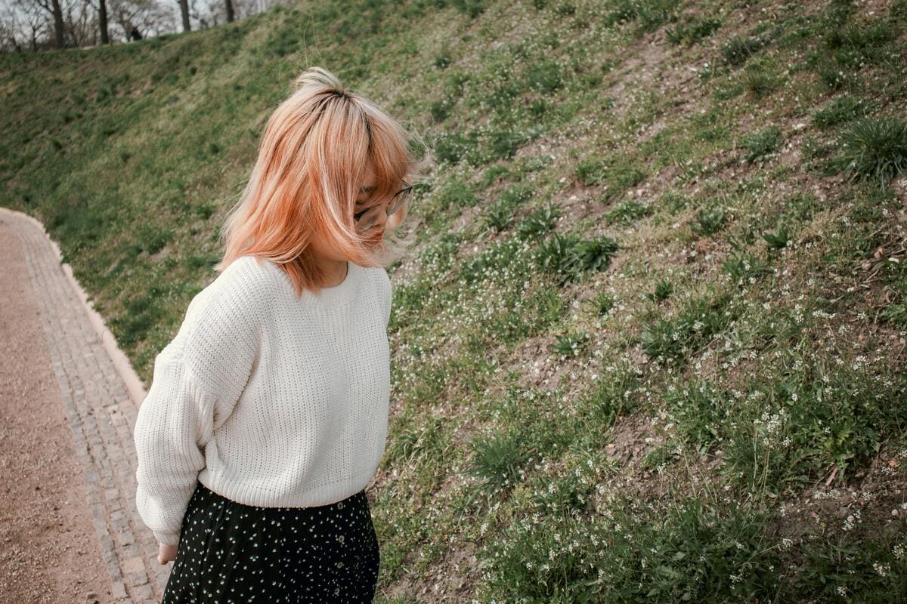

+++
title = "Bilder Test"
date = "2024-05-06"
draft = false
pinned = false
tags = ["Deutsch", "Reportage"]
image = "kleines-bild.jpg"
+++

Test erfolgreich!



Der Inhalt einer Box muss wie hier von zwei Blöcken umgeben werden.



alsdkfjalskdf